# Database handover

PostgreSQL 16. Schema is managed by Prisma migrations in `prisma/migrations`; never edit tables by hand.

## Connecting with DBeaver

1. New connection → PostgreSQL. Host `localhost`, port `5432`, database `dsp`.
2. For day-to-day browsing use the read-only role created by the `reporting_role` migration: user `reporting`, password from the `REPORTING_PASSWORD` you set when running that migration (default in local Docker: `reporting`). This role can `SELECT` on every table and nothing else.
3. Application user `dsp` / `dsp` has full access and is for the API only.

Production: point at the managed Postgres host, use TLS (`sslmode=require`), and never hand out the application user.

## Entity relationship overview

```mermaid
erDiagram
  Company ||--o{ User : has
  Company ||--|| License : has
  Company ||--o{ Screen : owns
  Company ||--o{ ScreenGroup : owns
  Company ||--o{ MediaAsset : owns
  Company ||--o{ Playlist : owns
  Company ||--o{ Schedule : owns
  Company ||--o{ Layout : owns
  Company ||--o{ TemplateInstance : owns
  Company ||--o{ CanvasSet : owns
  Company ||--o{ ActivityLog : logs
  Screen ||--o| ScreenDevice : has
  Screen ||--o| ScreenAssignment : desired_state
  Screen }o--o{ ScreenGroup : member_via_ScreenGroupMember
  Screen ||--o{ PlayerHeartbeat : reports
  Playlist ||--o{ PlaylistItem : contains
  MediaAsset ||--o{ PlaylistItem : referenced_by
  MediaAsset ||--o{ MediaDerivative : has
  Layout ||--o{ LayoutZone : has
  Template ||--o{ TemplateInstance : instantiated_as
  Offer ||--o{ OfferView : viewed
  ScratchCampaign ||--o{ ScratchPrize : offers
  ScratchCampaign ||--o{ ScratchAttempt : records
  ScratchAttempt ||--o| ScratchWinner : produces
  CanvasSet ||--o{ CanvasMember : positions
  User ||--o{ RefreshToken : sessions
  User ||--o{ PushSubscription : devices
```



## Table dictionary

| Table | Purpose | Tenant column | Key columns |
|---|---|---|---|
| `Company` | Tenant master record | — | `code` (unique, 5 digits), `status`, `overLimit` |
| `User` | Login identity | `companyId` (null for Super Admin) | `email` unique, `platformRole`, `companyRole`, `isActive` |
| `RefreshToken` | Session families | via user | `tokenHash` unique, `familyId`, `revokedAt` |
| `PasswordReset` | One-time reset tokens | via user | `tokenHash`, `expiresAt`, `usedAt` |
| `License` | Manual screen licence | `companyId` unique | `screenLimit`, `state`, `overLimit` |
| `PairingSession` | Codes shown on unpaired players | `companyId` after pairing | `code` unique, `deviceId`, `status`, `expiresAt` |
| `Screen` | Logical paired screen | `companyId` | `status`, `pairingStatus`, `manifestVersion`, `ackVersion`, `syncState`, `deviceCredentialHash` |
| `ScreenDevice` | Player hardware metadata | via screen | `deviceId` unique, `model`, versions, `ip` |
| `ScreenGroup`, `ScreenGroupMember` | Named groups and membership | `companyId` | unique `(companyId, name)` |
| `PlayerHeartbeat` | Diagnostics time series | via screen | `payload` JSON |
| `MediaAsset` | Uploaded file metadata | `companyId` | `type`, `status`, `storageKey` unique, `checksum`, dimensions |
| `MediaDerivative` | Thumbnails and PDF pages | via asset | `kind`, `page` |
| `Playlist`, `PlaylistItem` | Ordered content | `companyId` | `version`, `(playlistId, position)` unique |
| `Schedule` | Time-based assignment | `companyId` | `targetKind`, `targetId`, `startsAt`, `endsAt`, `timezone` |
| `ScreenAssignment` | Desired state per screen | via screen | `kind`, `refId`, `version`, `activateAt` |
| `Layout`, `LayoutZone` | Presets (`isPreset`) and company layouts with fixed zones | `companyId` (null for presets) | zone `x,y,w,h` as fractions 0..1, bindings |
| `Template`, `TemplateInstance` | Fixed promotional templates and customer values | `companyId` on instances | `fields` JSON, `values` JSON, `outputKey` |
| `Offer`, `OfferView` | Marketplace and view events | `companyId` on views | `status`, visibility window, `(offerId, userId, viewedAt)` index |
| `Notification`, `PushSubscription` | Push campaigns and device tokens | `companyId` on subscriptions | `audience` JSON, `externalId` unique |
| `ScratchCampaign`, `ScratchPrize`, `ScratchAttempt`, `ScratchWinner` | Scratch & Win | `companyId` on attempts | `allocation` JSON (weights, server-only), `remaining`, `idempotencyKey` unique |
| `CanvasSet`, `CanvasMember` | Synchronized screen sets | `companyId` | `position`, `activateAt` |
| `ActivityLog` | Audit trail | `companyId` (null for platform events) | `action`, `resourceType`, `status`, `summary` |
| `IdempotencyKey` | Stored responses for safe retries | via user | `(key, userId)` unique |

## Enums

| Enum | Values |
|---|---|
| `PlatformRole` | `SUPER_ADMIN`, `CUSTOMER` |
| `CompanyRole` | `ADMIN`, `EDITOR`, `VIEWER` |
| `CompanyStatus` | `ACTIVE`, `INACTIVE`, `SUSPENDED` |
| `LicenseState` | `ACTIVE` (pair and publish), `SUSPENDED` (read-only), `DISABLED`, `EXPIRED` |
| `ScreenStatus` | `ONLINE` (presence key alive), `OFFLINE` (no heartbeat for 90 s), `ERROR` (player reported) |
| `SyncState` | `SYNCED` (ack ≥ manifest), `PENDING`, `SYNCING`, `FAILED` |
| `MediaStatus` | `UPLOADING`, `PROCESSING`, `READY`, `FAILED` |
| `AssignmentKind` | `PLAYLIST`, `LAYOUT`, `TEMPLATE_INSTANCE`, `CANVAS` |
| `OfferStatus` | `DRAFT`, `PUBLISHED`, `UNPUBLISHED`, `EXPIRED` |
| `CampaignStatus` | `DRAFT`, `SCHEDULED`, `ACTIVE`, `ENDED`, `INACTIVE` (effective status also derives from the window) |

## Sample read-only queries

```sql
-- Screen status per company
SELECT c.name, s.status, count(*) FROM "Screen" s JOIN "Company" c ON c.id = s."companyId"
WHERE s."pairingStatus" = 'PAIRED' GROUP BY c.name, s.status ORDER BY c.name;

-- Offer views: total and unique viewers
SELECT o.title, count(*) AS total_views, count(DISTINCT v."userId") AS unique_viewers, max(v."viewedAt") AS last_viewed
FROM "Offer" o LEFT JOIN "OfferView" v ON v."offerId" = o.id GROUP BY o.id ORDER BY total_views DESC;

-- Active schedules right now
SELECT s.id, p.name AS playlist, s."targetKind", s."targetId", s."startsAt", s."endsAt", s.timezone
FROM "Schedule" s JOIN "Playlist" p ON p.id = s."playlistId"
WHERE s."startsAt" <= now() AND (s."endsAt" IS NULL OR s."endsAt" > now());

-- Licence usage
SELECT c.name, l."screenLimit", count(s.id) AS paired, l."screenLimit" - count(s.id) AS available, l.state, l."overLimit"
FROM "Company" c JOIN "License" l ON l."companyId" = c.id
LEFT JOIN "Screen" s ON s."companyId" = c.id AND s."pairingStatus" = 'PAIRED'
GROUP BY c.name, l."screenLimit", l.state, l."overLimit" ORDER BY c.name;

-- Scratch prize inventory
SELECT sc.title, sp.name, sp.quantity, sp.remaining, sp.quantity - sp.remaining AS awarded
FROM "ScratchPrize" sp JOIN "ScratchCampaign" sc ON sc.id = sp."campaignId" ORDER BY sc.title, sp.name;
```

## Backup and restore

```bash
# Backup (from the host, Docker Postgres)
docker compose -f docker/docker-compose.yml exec -T postgres pg_dump -U dsp -Fc dsp > backup-$(date +%F).dump

# Restore into an empty database
docker compose -f docker/docker-compose.yml exec -T postgres pg_restore -U dsp -d dsp --clean --if-exists < backup-2026-09-16.dump
```

Managed providers (RDS, Neon, Supabase) offer automated snapshots; enable daily snapshots with at least 7-day retention and test a restore before go-live.
